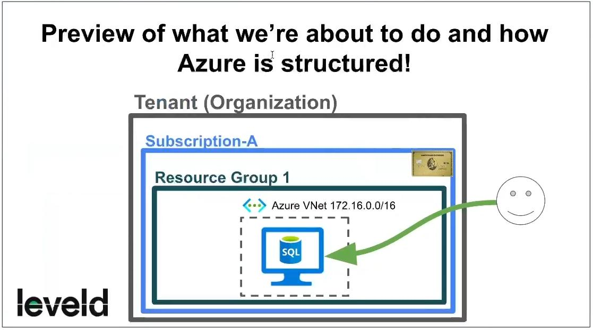
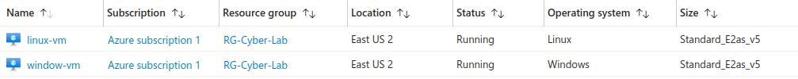

**Create our Account (Tenant) and Subscription**
- Create Azure Account (do not use your work or school account)
- Create Azure Subscription (try to make a free one with $200 credits for the first 30 days): [https://azure.microsoft.com/en-us/free/](https://azure.microsoft.com/en-us/free/)
- Open a notepad and start recording stuff about our subscription so you don’t forget. We will use this for the rest of the lab.

### **Virtual Machine > Create**

**Create Windows 10 Pro Virtual Machine, name it: "window-vm"
- Name the Resource Group: **RG-Cyber-Lab**
- Region: **EAST US 2**
- Availability zone: **Zone 2**
- Image: **Windows 10 Pro, version 22H2 - x64 Gen2**
- Size: **Lowest cost with at least 2 vCPUs**
- Create Username/Password
- Create new Virtual Network: **Lab-VNet**

**Create one more Virtual Machine running Ubuntu (Linux), name it: “linux-vm”**
- Same Region, Resource Group, and VNet as windows-vm
- Name the Resource Group: **RG-Cyber-Lab**
- Region: **EAST US 2**
- Availability zone: **Zone 2**
- Image: **Ubuntu Server 20.04 LTS - x64 Gen2**
- Size: **Lowest cost with at least 2 vCPUs**
- Create Username/Password
- Virtual Network: **Lab-VNet**

### Network Security Groups > -vm-nsg
Configure Network Security Group (Layer 4 Firewall) to allow all traffic inbound

**Window-vm-nsg/Linux-vm-nsg > Inbound security rules**
- Delete pre-made RDP/SSH rule
- Add new rule
	- Source: **Any**
	- Source port ranges: **\***
	- Destination: **Any**
	- Service: **Custom**
	- Destination port ranges: **\***
	- Protocol: **Any**
	- Action: **Allow**
	- Name: **DANGER_AllowAnyCustomAnyInbound**

We will use the VMs in the next lab, so feel free to leave them on unless you’re done for the day.