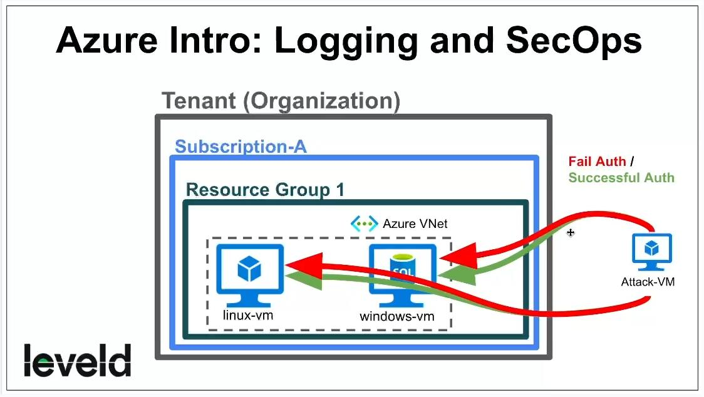

**Do you need your VMs to be on for this lab?**  
YES (windows-vm, linux-vm)

### Azure Intro: Logging and SecOps
Logging is an essential component of security operations. Without proper logging, it can be difficult or impossible to identify and respond to security incidents.

Logging allow organizations to track activity on their network systems, and to monitor for signs of suspicious or malicious behavior.

## Admin Mode (pretend you are normal admin):
**Create another Windows VM in a region outside the US, name it: "attack-vm"**
- Create new Resource Group and name it: **RG-Cyber-Lab-Attacker**
- Create new Virtual Network: **Lab-VNet-Attacker**
- Log into the VM to make sure it works
- Retrieve the public IP address of “window-vm” from the Azure Portal, save it for the next steps

## Attacker Mode (pretend you are an attacker):
**Generated some failed RDP logs against “windows-vm”**
- From within of “**attack-vm**”, attempt to RDP into “**windows-vm**” with the wrong credentials
- Repeat this step 2 more times with the wrong username and password

**Generated some failed MS SQL Auth logs against “windows-vm”**
- Within “**attack-vm**”, install SQL Server Management Studio
- Attempt to connect to the SQL Server on “**windows-vm**” with a bad password

**Generated some failed SSH logs against “linux-vm”**
- Still within “**attack-vm**”, attempt to SSH into “**linux-vm**” with the wrong credentials
- Log out of “**attack-vm**”, now you are back to your own computer

## Admin Mode (pretend you are normal admin):
- From your own computer, RDP back into “windows-vm”
- Inspect the failures and successes (Security Log for RDP, Application Log for SQL)
	- Windows Log > Security > Audit Failure Event ID: 4625
	- Windows Log > Application > Audit Failure Event ID: 18456
- Take note of the EventIDs, messaging, Source IP Addresses, etc.

SSH into the Linux VM, observe the logs with the following commands:

	cat /var/log/auth.log | grep password
	cat /var/log/auth.log | grep Accepted

**TURN VMs OFF! (do not need for next video)**