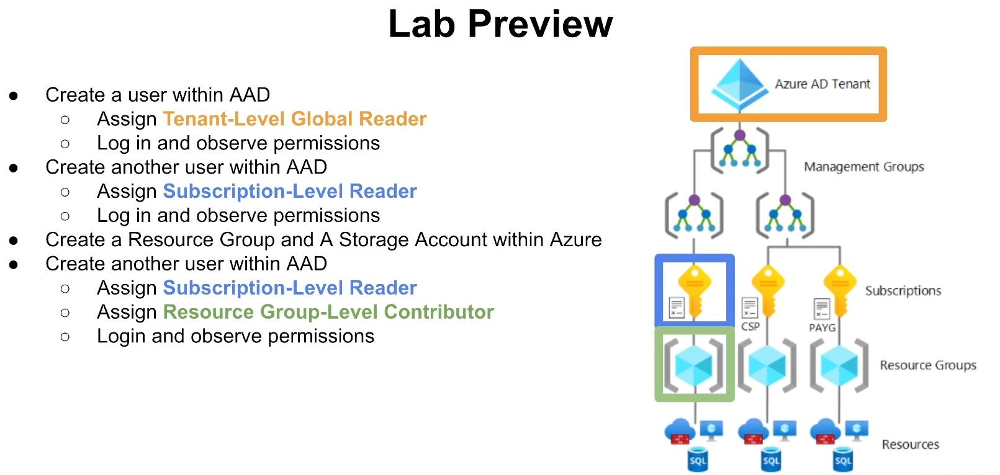
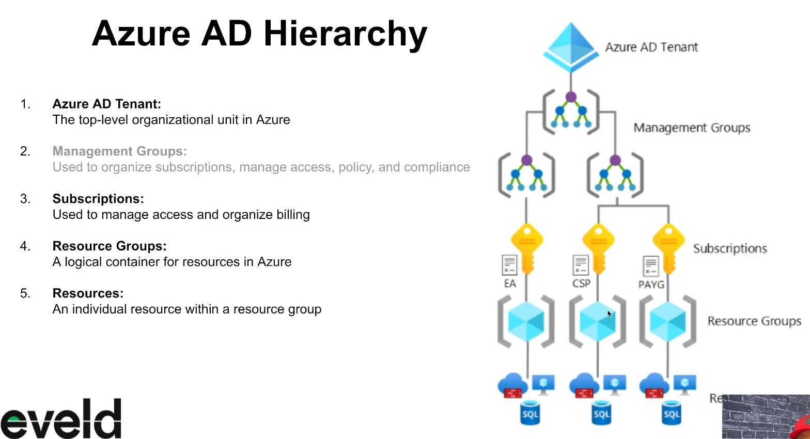
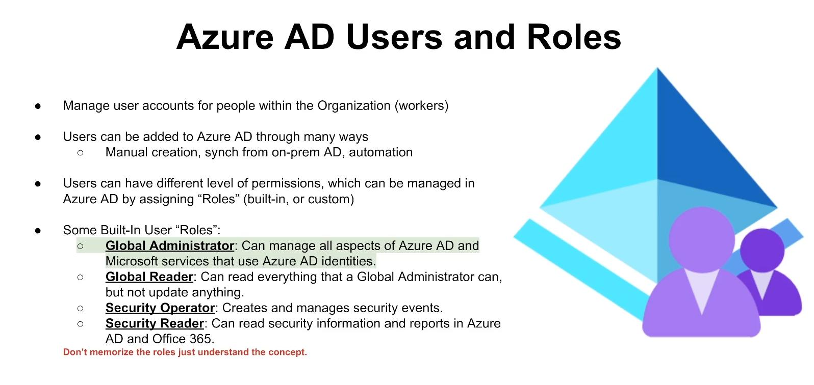
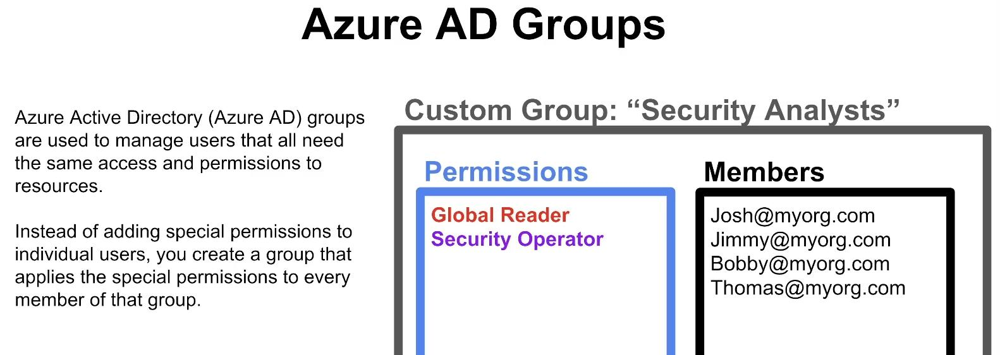
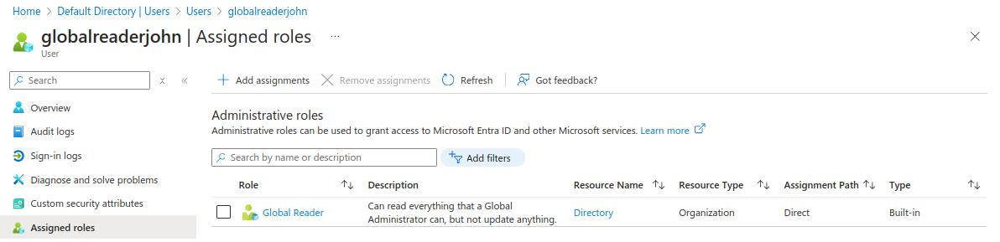

**Do you need your VMs to be on for this lab?**  
NO

## Microsoft Entra ID
- Cloud-based Identity and Access management Service
	- Stores user accounts and can manage access to other cloud resources
- Cloud version of "on-premises" Active Directory
	- Can be synchronized with on-premises Active Directory

### Disabling Multi-Factor Authorization (For Lab Purposes)
Note: Disabling MFA is not recommended as it can leave your account and users susceptible to attacks and/or compromised.
- Microsoft Entra ID > Properties > Security defaults > Manage security defaults > Disable
### Configure and Observe Tenant-Level Global Reader
Create a user within Azure Active Directory (AAD)
- Microsoft Entra ID > Manage > Users > + New user > Create new user
	- Username: **globalreaderjohn**
- Assign **Tenant-Level Global Reader**
	- globalreaderjohn > Assigned roles > + Add assignment > Global Reader  

  

- In a new browser/incognito, log in as **globalreaderjohn** and observe result of being a Tenant Level “Global Reader” 
- Close browser/incognito when satisfied

### Configure and Observe Subscription Reader
Back in main browser, create another user within AAD
- Microsoft Entra ID > Manage > Users > + New user > Create new user
	- Username: **subreaderjane**
- Assign **Subscription-Level Reader** 
	- Subscriptions > Azure subscription 1 > Access control (IAM) > Add role assignment
	- Reader > Select member (subreaderjane) > Review + assign
- In a new browser/incognito, log in as **subreaderjane** and observe result of being a Subscription Level “Global Reader”
- Close browser/incognito when satisfied

### Configure and Observe Resource Group Contributor (like an admin but cant assign roles)
Back in main browser, create another user within AAD
- Microsoft Entra ID > Manage > Users > + New user > Create new user
	- Username: **rgcontributordave**
- Create a new resource group called “**Permissions-Tester**”
- Assign **Resource Group-level Contributor**
	- Resource Group > Permissions-Tester > Access control (IAM) > Add role assignment
	- Priviledged administrator roles > Contributor > Select member (rgcontributordave) > Review + assign
- In a new browser/incognito, log in as **rgcontributordave** and observe the result of being a Resource Group Level Contributor

## Interview Questions
1. What is Azure Active Directory, and how is it used in cloud-based environments like Microsoft Azure?
2. How can Azure Active Directory help organizations manage access to resources in the cloud?
3. What are roles and permissions, and how are they used to manage access to resources in Azure?
4. Can you talk about roles/permissions at the tenant level in Azure?
5. Can you talk about roles/permissions at the subscription level in Azure?
6. Can you talk about roles/permissions at the Resource Group level in Azure?
7. How can administrators use Azure Active Directory to manage access to resources across multiple Azure subscriptions?
8. How can administrators use custom roles in Azure Active Directory to provide more granular access control to specific resources or actions within the subscription?
9. How can administrators use Azure Active Directory to manage access to resources in a hybrid cloud environment that includes both Azure and on-premises resources?
10. What are some best practices for using Azure Active Directory to manage access to resources in a secure and efficient manner, and how can you ensure that access is granted only to authorized users and groups? 