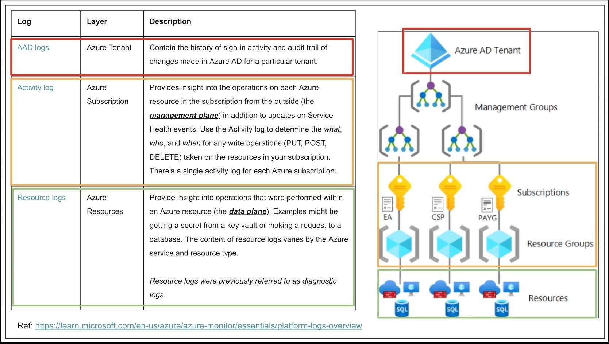
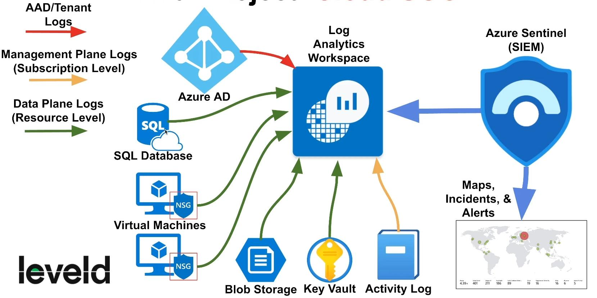

### Entra ID Logs (FKA AAD Logs)
- Layer: Azure Tenant 
- Contain the history of sign-in activity and audit trail of changes made in Azure AD for a particular tenant.
	- i.e., sign ins, failed attempts, user account creations and role assignments
### Activity Log 
- Layer: Azure Subscription 
- Provides insight into the operations on each Azure resource in the subscription from the outside (the **management plane)** in addition to updates on Service Health events. Use the Activity log to determine the what, who, and when for any write operations (PUT, POST, DELETE) taken on the resources in your subscription. There's a single activity log for each Azure subscription.
- https://learn.microsoft.com/en-us/azure/azure-monitor/essentials/activity-log
### Resource Logs 
- Layer: Azure Resources 
- Provide insight into operations that were performed within an Azure resource (the **data plane**). Examples might be getting a secret from a key vault or making a request to a database. The content of resource logs varies by the Azure service and resource type. Resource logs were previously referred to as diagnostic logs.
	- i.e., logs or attempts into VM, accessing Key Logs
- https://learn.microsoft.com/en-us/azure/azure-monitor/essentials/resource-logs

Ref: https://learn.microsoft.com/en-us/azure/azure-monitodessentials/platform-logs-overview 