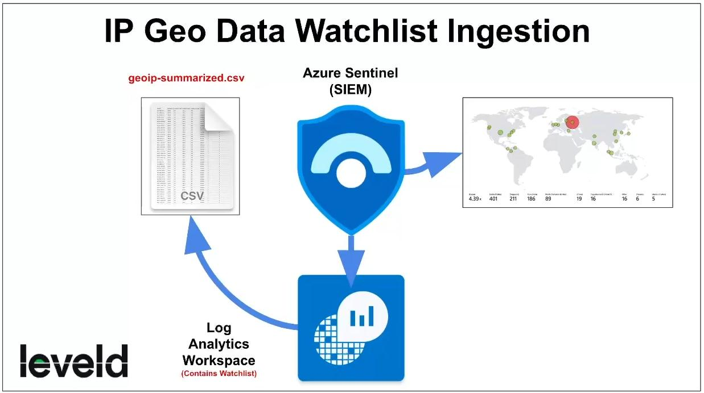

**Do you need your VMs to be on for this lab?**  
NO

**Put Large Geo-Data Files in Azure Storage**  
Download this file onto your PC: [https://github.com/joshmadakor1/Cyber-Course-v2/blob/main/Sentinel-Maps(JSON)/geoip-summarized.csv](https://github.com/joshmadakor1/Cyber-Course-v2/blob/main/Sentinel-Maps(JSON)/geoip-summarized.csv)  
or [geoip-summarized.csv](images/geoip-summarized.csv)

### Creating Resource Log Analytics Workspace (Log Aggregator)
**Log Analytics Workspace > Create**
- Resource Group: **RG-Cyber-Lab**
- Name: **LAW-Cyber-Lab-01**
- Region: **East US 2**

### Setting Up Sentinel and Connecting it to Log Analytics Workspace
**Microsoft Sentinel > Create > LAW-Cyber-Lab-01 > Add**

### Create the Geoip Watchlist
**Microsoft Sentinel > Watchlist > New**
- Name/Alias: **geoip**
- Source type: **Local file**
- Number of lines before row: **0**
- Upload file: [geoip-summarized.csv](images/geoip-summarized.csv)
- Search Key: **network**
	- *Note: If the SearchKey says "Text/Csv" on the "Review + create" tab, continue to create. After creating the Watchlist, if you click on "geoip", it will correctly say "network" on the new popup under SearchKey.*
	- *Note: It may take roughly 45 minutes to fully upload all 27,000 rows, the status can be seen on the popup panel.*

Next, go to Log Analytics Workspace and make sure something comes out when you query  
**GetWatchlist("geoip")**

It should look like this:  

  

Ensure the watchlist finishes uploading before moving to the next lab

We will use VMs in the next lab, so you can turn them on now, or before you begin the lab if you want to take a break.