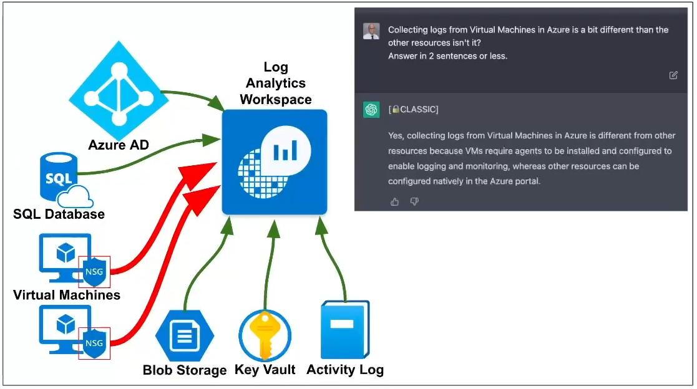

**Do you need your VMs to be on for this lab?**  
YES (windows-vm, linux-vm)

### Enable Microsoft Defender for Cloud for Log Analytics Workspace
**Microsoft Defender for Cloud > Management > Environment settings > LAW-Cyber-Lab-01 > ... > Edit settings**
- Defender plans
	- Servers: **On**
	- SQL servers on machines: **On**
	- **Save**
- Data collection
	- **All Events**
	- **Save**
### Enable Microsoft Defender for Cloud for Subscription
**Microsoft Defender for Cloud > Management > Environment settings > Azure subscription > ... > Edit settings**
- Servers: **On**
- Databases: **On**
- Storage: **On**
- Key Vault: **On**
- **Save**
### Enable Microsoft Defender for Cloud Continuous Export in Environment Settings
**Continuous export > Log Analytics workspace**
- Export enabled: **On**
- Exported data type: **Enable All**
- Export frequency: **Enable All**
- Export configuration
	- Resource group: **RG-Cyber-Lab**
- Export target
	- Subscription: **Azure subscription**
	- Select target workspace: **LAW-Cyber-Lab-01**
- **Save**

Check "**Log Analytics workspaces**" and make sure Microsoft Defender for Cloud didn't create another workspace, delete if so.

We will continue using the VMs in the next lab.
