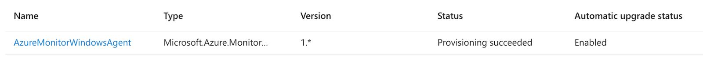
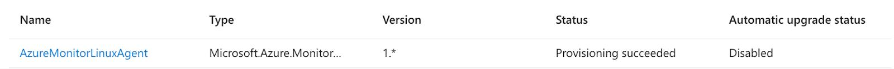

**Do you need your VMs to be on for this lab?**
YES (windows-vm, linux-vm)
### Create an Azure Storage Account (sacyberlab0x, name needs to be unique)
- MUST be in the same region as VMs
- This will be used to store the NSG Flow Logs which we are about to create

### Enable Flow logs for both both Network Security Groups (NSGs)
- Make sure to send to our Log Analytics Workspace
- If there is no storage account listed, it means it’s in a different region from your VMs, so you’ll need to create another storage account in the same region

### Configure Data Collection Rules for our VMs within Microsoft Sentinel
Turn on VMs if they aren’t already on  
  
**Microsoft Sentinel -> Your Log Analytics Instance -> Content Hub**
- Search for “Windows Security Events” and Install it
- 

**DCR-Windows:**
- Select appropriate VM
- Configure Windows Data Sources: Security (All)

**Sentinel -> Your Log Analytics Instance -> Content Hub**
- Search for “Syslog” and Install it
- 

**DCR-Linux**
- Configure Linux Data Sources (Auth: Debug only)
	- Linux-vm-logs
  

Check under VM -> Settings -> Extensions Applications for both the Windows and Linux VM and ensure the agent is installed with “Provisioning succeeded”

  
Begin querying Log Analytics for logs from the VMs and NSGs; do not move on from this lab until you see logs from all three sources, or at least the linux/windows logs:
- Syslog (linux)
- SecurityEvent (windows)
- AzureNetworkAnalytics_CL (Network Security Groups/NSGs)

Linux:

  
Windows:

  
  
NSGs:

  
  
When the logs are coming in, test generating a couple logs (failed logons for Windows/Linux) and observe them in Log Analytics.

Visual Recap: [Logging and Monitoring: Enable MDC and Configure Log Collection for Virtual Machines](https://docs.google.com/presentation/d/1Sd71Zm_J8PY06L3_YzoOpvctenhFFxJe9wB_OwA-MVk/edit#slide=id.g2191f5eb6b4_0_0)

As long as you see logs coming in, you can shut down your Virtual Machines to save money.