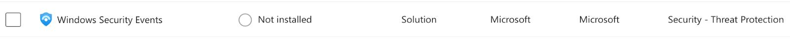
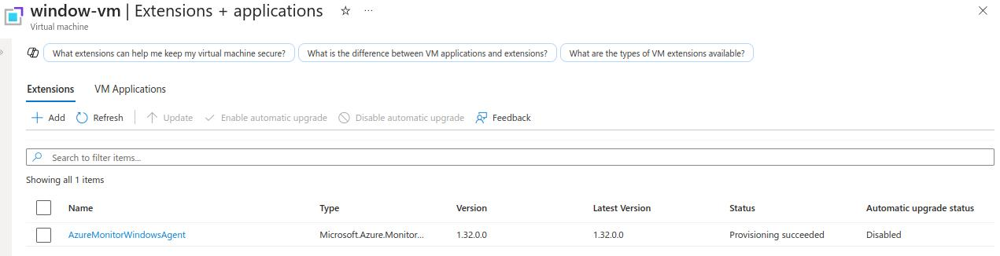
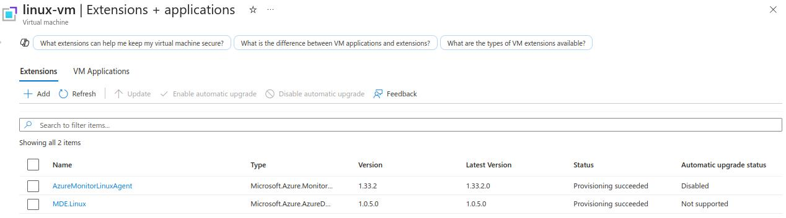
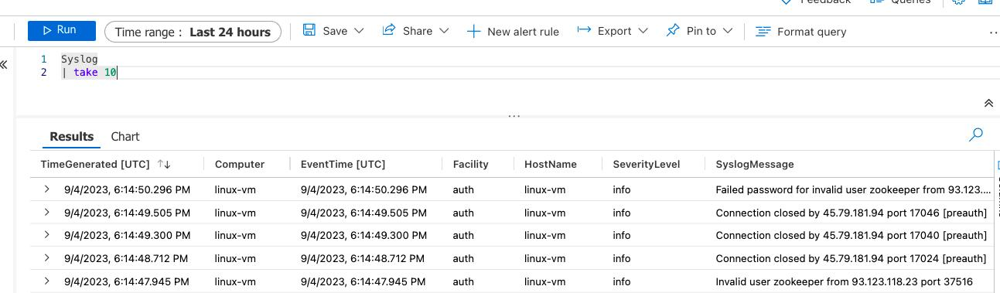
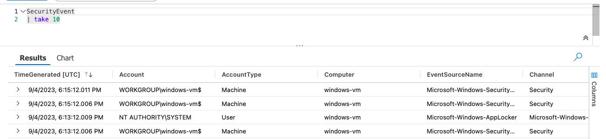
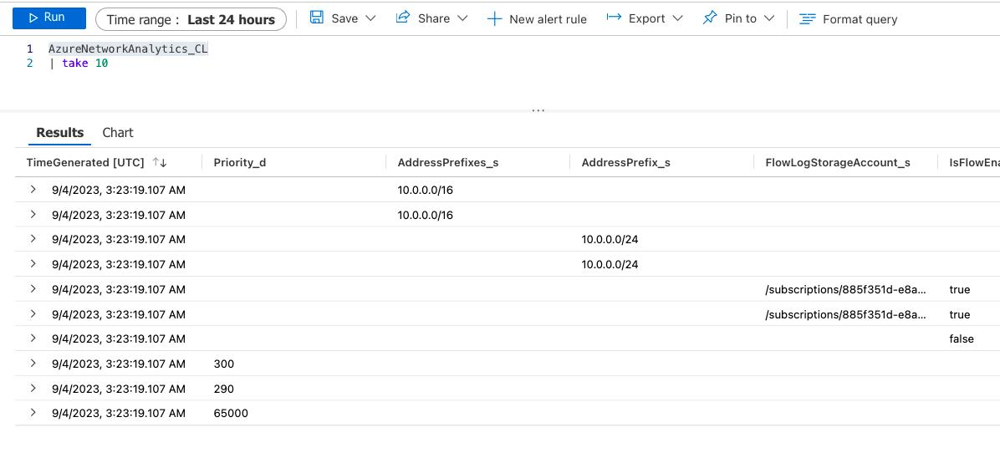

**Do you need your VMs to be on for this lab?**  
YES (windows-vm, linux-vm)
### Create an Azure Storage Account
This will be used to store the NSG Flow Logs which we are about to create
**Storage Account > Create**
- Subscription: **Azure subscription**
	- Resource group: **RG-Cyber-Lab**
- Storage account name: **cyberlabsa00001x (Must be unique)**
- Region: **East US 2 (MUST be same as VMs)**
- **Review + create > Create**
### Enable Flow logs for both both Network Security Groups 
**Network security groups > windows-vm-nsg or linux-vm-nsg (doesn't matter) > Monitoring > NSG flow logs > Create**
- Flow log type: **Network security group**
- Select **target resource > Network security group > select both linux-vm-nsg and windows-vm-nsg > Confirm selection**
- Storage accounts: **cyberlabsa00001x**
- Retention (days): **60**
- **Next: Analytics**
	- Flow logs version: **Version 2**
	- Check **Enable traffic analytics**
	- Traffic analytics processing interval: **Every 10 mins**
- **Review + create > create**
- *If there is no storage account listed, it means it’s in a different region from your VMs, so you’ll need to create another storage account in the same region*
### Configure Data Collection Rules for our VMs within Microsoft Sentinel (Windows and Linux VMs should be on)
**Microsoft Sentinel > LAW-Cyber-Lab-01 > Content Management > Content Hub**
- Search for “**Windows Security Events**” and **Install** it
	- 
	- After Installation, click on **Manage**
		- Enable "**Windows Security Events via AMA**", then click on "**Open connector page > Create data collection rule**"
			- Rule name: **DCR-Windows**
		- **Next: Resources**
			- Select **window-vm**
		- **Next: Collect**
			- Select which events to stream: **All Security Events**
		- **Review + create > Create**
  
- Search for “**Syslog**” and Install it
	- 
	- After Installation, click on **Manage**
		- Enable "**Syslog via AMA**", then click on "**Open connector page > Create data collection rule**"
			- Rule name: **DCR-Linux**
		- **Next: Resources**
			- Select **linux-vm**
		- **Next: Collect**
			- LOG_AUTH: **LOG_DEBUG** (MAKE sure correct Facility and Log Level are selected)
		- **Review + create > Create**
###  Ensure the agent is installed with “Provisioning succeeded”
**DCR-Windows: Virtual machines > window-vm > Settings > Extensions + applications**

**DCR-Linux: Virtual machines > linux-vm > Settings > Extensions + applications**

### Querying Logs in Log Analytics Workspace
Begin querying Log Analytics for logs from the VMs and NSGs; do not move on from this lab until you see logs from all three sources, or at least the linux/windows logs.  
**Log Analytics workspaces > LAW-Cyber-Lab-01 > Logs**
- `Syslog (linux)
- `SecurityEvent (windows)
- `AzureNetworkAnalytics_CL` (Network Security Groups/NSGs)
  
*These 3 logs should be listed under **Settings > Tables** also*
  
Linux:

  
Windows:

  
  
NSGs:

  
  
When the logs are coming in, test generating a couple logs (failed logons for Windows/Linux) and observe them in Log Analytics.

Visual Recap: [Logging and Monitoring: Enable MDC and Configure Log Collection for Virtual Machines](https://docs.google.com/presentation/d/1Sd71Zm_J8PY06L3_YzoOpvctenhFFxJe9wB_OwA-MVk/edit#slide=id.g2191f5eb6b4_0_0)

As long as you see logs coming in, you can shut down your Virtual Machines to save money.