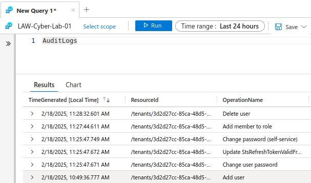

**Do you need your VMs to be on for this lab?**  
NO


## Admin Mode (pretend you are normal admin):
### Setup logging for Microsoft Entra ID and Generate Some Logs
**Create Diagnostic Settings to ingest Azure AD Logs**
**Microsoft Entra ID > Monitoring > Diagnostic settings > Add diagnostic setting**
- Diagnostic setting name: **ds-audit-signin**
- Enable **AuditLogs** and **SignInLogs**
- Enable **Send to Log Analytics workspace**

Check Log Analytics Workspace that the tables have been created: “**AuditLogs**” “**SigninLogs**”
### Create a Dummy User
**Microsoft Entra ID > Manage > Users > New user**
- Username: “**dummy_user**”
- Log in with it once (incognito window)
- Assign **dummy_user** the Role of **Global Administrator** on main account
- Delete **dummy_user**  
- Observe Audit Logs logs in Log Analytics Workspace  


Rebuild/understand this query:  
```
AuditLogs
| where OperationName == "Add member to role" and Result == "success"
| where TargetResources[0].modifiedProperties[1].newValue == '"Global Administrator"' or TargetResources[0].modifiedProperties[1].newValue == '"Company Administrator"' 
| order by TimeGenerated desc
| project TimeGenerated, OperationName, AssignedRole = TargetResources[0].modifiedProperties[1].newValue, Status = Result, TargetResources
```  

*Note: Some people’s tenant Global Administrator can show up as either Company Administrator or “Global Administrator”. Microsoft’s did this for some reason*
## Attacker Mode (pretend you are an attacker):
### Simulate Brute Force Attack against Microsoft Entra ID

### Create a Attack Dummy User
**Microsoft Entra ID > Manage > Users > New user**
- Username: “**dummy_attacker**”
- Produce 10-11 failed Logins with the portal
## Admin Mode (pretend you are normal admin):
### Observe SigninLogs in Log Analytics Workspace
Rebuild/understand this query:
```
SigninLogs
| where ResultDescription == "Invalid username or password or Invalid on-premise username or password."
| extend location = parse_json(LocationDetails)
| extend City = location.city, State = location.state, Country = location.countryOrRegion, Latitude = location.geoCoordinates.latitude, Longitude = location.geoCoordinates.longitude
| project TimeGenerated, ResultDescription, UserPrincipalName, AppDisplayName, IPAddress, IPAddressFromResourceProvider, City, State, Country, Latitude, Longitude
```
same as
```
SigninLogs
| where ResultDescription == "Invalid username or password or Invalid on-premise username or password."
| project TimeGenerated, ResultDescription, UserPrincipalName, AppDisplayName, IPAddress, City = LocationDetails.city, State = LocationDetails.state, Country = LocationDetails.countryOrRegion, Latitude = LocationDetails.geoCoordinates.latitude, Longitude = LocationDetails.geoCoordinates.longitude
```
You can turn off VMs.