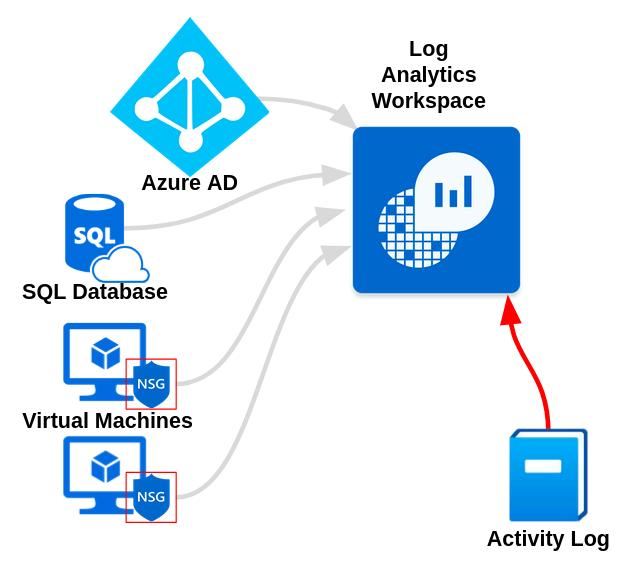
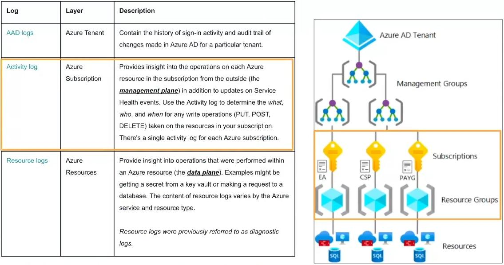

**Do you need your VMs to be on for this lab?**  
NO



### Export Azure Activity Logs to Log Analytics Workspace
**Monitor > Activity Log > Export Activity Logs > Add diagnostic setting**
- Diagnostic setting name: **ds-azure-activity**
- **Logs**
	- Enable all
- **Destination details**
	- Enable **Send to Log Analytics workspace**
	- Log Analytics workspace: **LAW-Cyber-Lab-01**
- Save
### Generate Logs
- Create a new Resource Group
	- **Resource groups > Create**
	- Resource group name: **Scratch-Resource-Group**
	- Review + Create
- Create another new Resource Group
	- Resource group name: **Critical-Infrastructure-Wastewater**
	- Review + Create
- Delete both “**Scratch-Resource-Group**” and “**Critical-Infrastructure**” (DO NOT ACCIDENTALLY DELETE YOUR LAB RESOURCE GROUP)
### Test Lab Queries
```
// Querying for the deletion of critical Resource Groups
AzureActivity
| where ResourceGroup startswith "Critical-Infrastructure-"
| order by TimeGenerated
```

```
// Querying for changes to network security groups
AzureActivity
| where OperationNameValue == "MICROSOFT.NETWORK/NETWORKSECURITYGROUPS/SECURITYRULES/WRITE"
// Optionally, specific Resource Groups:
// | where ResourceGroup in ("resource-group-1", "resource-group-2") 
| order by TimeGenerated
```

```
// Deletion activities within a certain timespan
AzureActivity
| where OperationNameValue endswith "DELETE"
| where ActivityStatusValue == "Success"
| where TimeGenerated > ago(30m)
| order by TimeGenerated
```

```
// From Microsoft Defender for Cloud Security Events
AzureActivity
| where CategoryValue == "Security"
```

```
// Just stuff happening on the Management Plane
AzureActivity
| where CategoryValue != "Administrative"
```

You can turn/leave VMs off for next lesson.