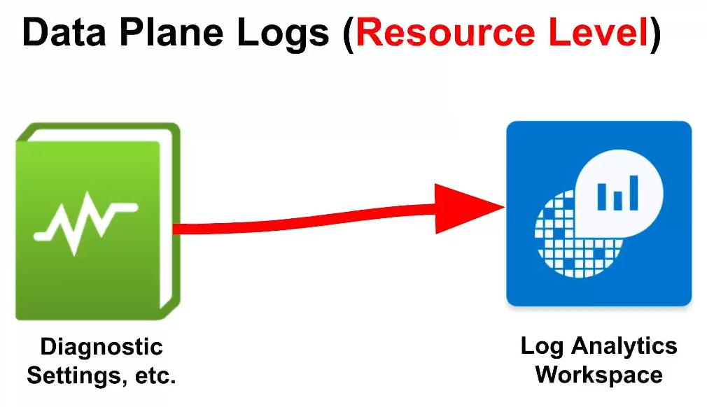

<b><u>Resource Logs (aka Diagnostic Logs)</u></b> - Provides insight into operations that were performed within an Azure resource (the **Data Plane**). Examples might be getting a secret from a Key Vault or making a request to a database. The contents of **Resource Logs** varies by the Azure service and resource type.

<b><u>Configure Logging for Azure Storage</u></b>
Configure logging for your storage account by enabling diagnostic settings for blob storage.
- Collect All Logs and Metrics (metrics will record auth failures) and send to your **Log Analytics Workspace** instance
	- **Storage Accounts** -> Monitoring\[Diagnostic settings]  -> blob -> +Add diagnostic setting
	- 

<b><u>Configure Logging for Key Vault</u></b>
Create a Key Vault Instance and configure logging by enabling diagnostic settings
- Collect the audit log and send to your **Log Analytics Workspace** instance
	- **Key Vault** -> +Create key vault
	- 
	- 
- Add a secret to **Key Vault** called "Tenant-Global-Admin-Password" with a made up password
	- **Key Vault** -> Objects\[Secrets] -> +Generate/Import
	- 
- Observe the key in **Key Vault**
- Enable monitoring for Key Vault
	- **Key Vault** -> Monitoring\[Diagnostic Settings] -> +Add diagnostic setting
	- 

Generate some Logs for Storage Account and Key Vault
- Generate some Logs for Azure Storage (read some blobs/files)
- Observe the Logs (they may take a moment to appear) -  KQL Query Cheat Sheet

**Storage Account Test Logs**

    // Authorization Error
    StorageBlobLogs 
    | where MetricResponseType endswith "Error" 
    | where StatusText == "AuthorizationPermissionMismatch"
    | order by TimeGenerated asc

    // Reading a bunch of blobs
    StorageBlobLogs
    | where OperationName == "GetBlob"

    //Deleting a bunch of blobs (in a short time period)
    StorageBlobLogs | where OperationName == "DeleteBlob"
    | where TimeGenerated > ago(24h)

    //Putting a bunch of blobs (in a short time period) 
    StorageBlobLogs | where OperationName == "PutBlob"
    | where TimeGenerated > ago(24h)

    //Copying a bunch of blobs (in a short time period)
    StorageBlobLogs | where OperationName == "CopyBlob"
    | where TimeGenerated > ago(24h)

**Key Vault Test Logs**

    // List out Secrets
    AzureDiagnostics
    | where ResourceProvider == "MICROSOFT.KEYVAULT"
    | where OperationName == "SecretList"

    // Attempt to view passwords that don't exist
    AzureDiagnostics
    | where ResourceProvider == "MICROSOFT.KEYVAULT"
    | where OperationName == "SecretGet"
    | where ResultSignature == "Not Found"

    // Viewing an actual existing password
    AzureDiagnostics
    | where ResourceProvider == "MICROSOFT.KEYVAULT"
    | where OperationName == "SecretGet"
    | where ResultSignature == "OK"

    // Viewing a specific existing password
    let CRITICAL_PASSWORD_NAME = "Tenant-Global-Admin-Password";
    AzureDiagnostics
    | where ResourceProvider == "MICROSOFT.KEYVAULT"
    | where OperationName == "SecretGet"
    | where id_s contains CRITICAL_PASSWORD_NAME

    // Updating a password Success
    AzureDiagnostics
    | where ResourceProvider == "MICROSOFT.KEYVAULT" 
    | where OperationName == "SecretSet"

    // Updating a specific existing password Success
    let CRITICAL_PASSWORD_NAME = "Tenant-Global-Admin-Password";
    AzureDiagnostics
    | where ResourceProvider == "MICROSOFT.KEYVAULT" 
    | where OperationName == "SecretSet"
    | where id_s endswith CRITICAL_PASSWORD_NAME
    | where TimeGenerated > ago(2h)

    // Failed access attempts
    AzureDiagnostics
    | where ResourceProvider == "MICROSOFT.KEYVAULT" 
    | where ResultSignature == "Unauthorized"