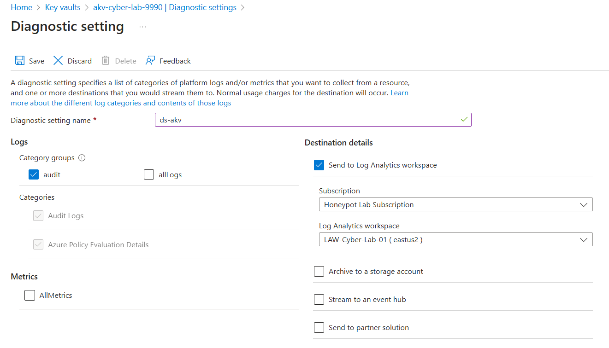

### Resource Logs (aka Diagnostic Logs)**
Provides insight into operations that were performed within an Azure resource (the **Data Plane**). Examples might be getting a secret from a Key Vault or making a request to a database. The contents of **Resource Logs** varies by the Azure service and resource type.  


  

### Configure Logging for Azure Storage
**Storage accounts > cyberlabsa00001x > Monitoring > Diagnostic settings > blob > Add diagnostic setting**
- Diagnostic setting name: **ds-storage-account**
- Enable **audit**
- Enable **Send to Log Analytics workspace**
	- Log Analytics workspace: **LAW-Cyber-Lab-01**
- Save
- 
### Create and Configure Key Vault
**Key Vault > Create key vault**
- **Basics**
	- Key vault name:: **akv-cyber-lab-0099**
	- Region: **East US2**
	- Next
- **Access configuration**
	- Permission model: **Vault access policy**
	- Review + create > create
	-  
### Configure Logging for Key Vault
- **Key Vault > akv-cyber-lab-0099 > Monitoring > Diagnostic Settings > Add diagnostic setting**
- Diagnostic setting name: **ds-akv**
- Enable **audit**
- Enable **Send to Log Analytics workspace**
	- Log Analytics workspace: **LAW-Cyber-Lab-01**
- Save
- 
### Adding a secret to Key Vault
**Key Vault > Objects > Secrets > Generate/Import**
- Name: **Tenant-Global-Admin-Password**
	- 
### Observe the key in Key Vault
**Key Vault > Objects > Secrets > Tenant-Global-Admin-Password > Show Secret Value**
### Enabling Access policies for users
**Key Vaults > akv-cyber-lab-0099 > Access policies >  Click name and edit**
- 
### Generate some Logs for Storage Account
-  **Storage account > cyberlabsa00001x > Data Storage > Containers > + Container**
	- Name: **test-container**
	- Create
	- Click on **test-container** on Containers page and upload random .txt file
### Observe the Logs -  KQL Query Cheat Sheet
**Storage Account Test Logs**
```
// Authorization Error
StorageBlobLogs 
| where MetricResponseType endswith "Error" 
| where StatusText == "AuthorizationPermissionMismatch"
| order by TimeGenerated asc
```

```
// Reading a bunch of blobs
StorageBlobLogs
| where OperationName == "GetBlob"
```

```
//Deleting a bunch of blobs (in a short time period)
StorageBlobLogs | where OperationName == "DeleteBlob"
| where TimeGenerated > ago(24h)
```

```
//Putting a bunch of blobs (in a short time period) 
StorageBlobLogs | where OperationName == "PutBlob"
| where TimeGenerated > ago(24h)
```

```
//Copying a bunch of blobs (in a short time period)
StorageBlobLogs | where OperationName == "CopyBlob"
| where TimeGenerated > ago(24h)
```

**Key Vault Test Logs**
```
// List out Secrets
AzureDiagnostics
| where ResourceProvider == "MICROSOFT.KEYVAULT"
| where OperationName == "SecretList"
```

```
// Attempt to view passwords that don't exist
AzureDiagnostics
| where ResourceProvider == "MICROSOFT.KEYVAULT"
| where OperationName == "SecretGet"
| where ResultSignature == "Not Found"
```

```
// Viewing an actual existing password
AzureDiagnostics
| where ResourceProvider == "MICROSOFT.KEYVAULT"
| where OperationName == "SecretGet"
| where ResultSignature == "OK"
```

```
// Viewing a specific existing password
let CRITICAL_PASSWORD_NAME = "Tenant-Global-Admin-Password";
AzureDiagnostics
| where ResourceProvider == "MICROSOFT.KEYVAULT"
| where OperationName == "SecretGet"
| where id_s contains CRITICAL_PASSWORD_NAME
```

```
// Updating a password Success
AzureDiagnostics
| where ResourceProvider == "MICROSOFT.KEYVAULT" 
| where OperationName == "SecretSet"
```

```
// Updating a specific existing password Success
let CRITICAL_PASSWORD_NAME = "Tenant-Global-Admin-Password";
AzureDiagnostics
| where ResourceProvider == "MICROSOFT.KEYVAULT" 
| where OperationName == "SecretSet"
| where id_s endswith CRITICAL_PASSWORD_NAME
| where TimeGenerated > ago(2h)
```

```
// Failed access attempts
AzureDiagnostics
| where ResourceProvider == "MICROSOFT.KEYVAULT" 
| where ResultSignature == "Unauthorized"
```