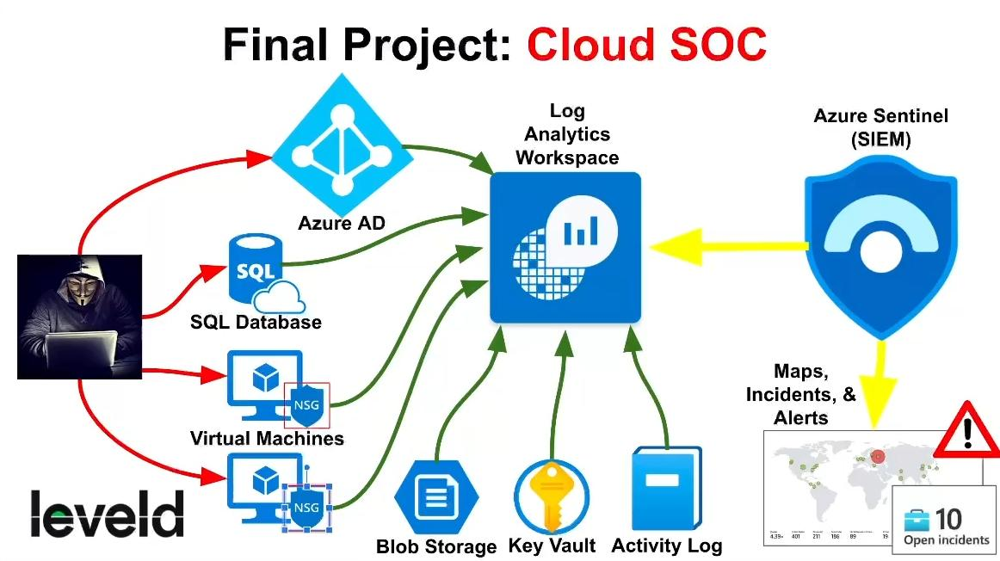
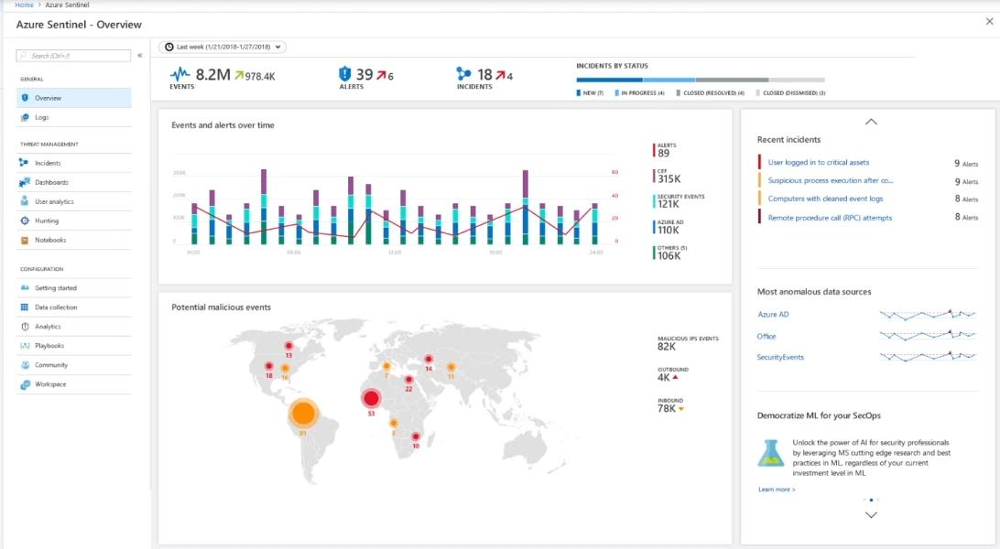

### Microsoft Sentinel Lab Overview
1. Bring in a bunch of logs (we actually did this already) 
2. Create a few world maps to visualize malicious events
	- **Windows VMs:** RDP / SMB / General Authentication Failures
	- **Linux VMS:** SSH Authentication Failures
	- **MS SQL Server (inside windows-vm):** Authentication Failures
	- **Network Security Groups:** Malicious Flows
3. Generate some of our own attack traffic 
4. Define a bunch of alerts for malicious activities that will trigger incidents 
5. Work our incidents to completion in alignment with NIST 800-61 
6. Record incidents/activities for 24 hours 
7. Harden our environment 
8. Record incidents/activities after another 24 hour and compare