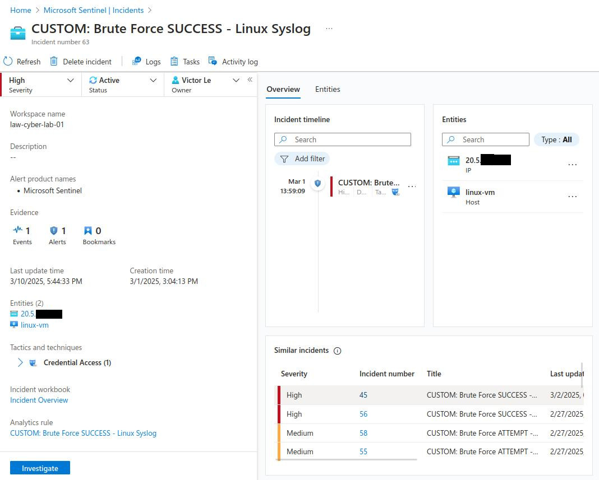
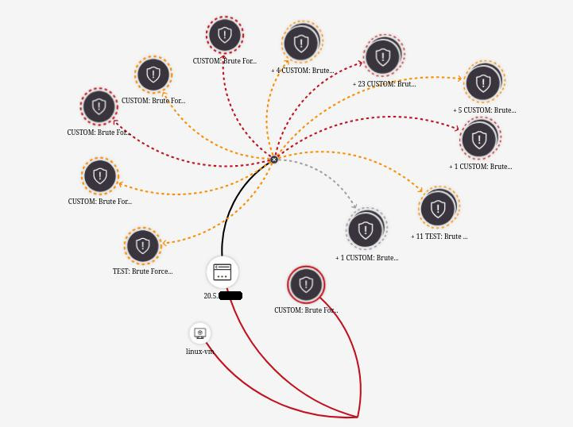

Work the incidents being generated within Azure Sentinel, in accordance with the NIST 800-61 Incident Management Lifecycle. Make use of the provided Pl


### Step 1: Preparation
- (We initiated this already by ingesting all of the logs into Log Analytics Workspace and Sentinel and configuring alert rules)
### Step 2: Detection & Analysis (You may have different alerts/incidents)
1. Set Severity, Status, Owner
2. View Full Details (New Experience)
3. Observe the Activity Log (for history of incident)
4. Observe Entities and Incident Timelines (are they doing anything else?)
5. “Investigate” the incident and continue trying to determine the scope
6. Inspect the entities and see if there are any related events
7. Determine legitimacy of the incident (True Positive, False Positive, etc.)
8. If True Positive, continue, if False positive, close it out

**Personal Incident Notes**  
Incident number 63  
Brute Force SUCCESS - Linux Syslog  
Affected system: linux-vm (IP 192.168.1.101)  
- Incident was created on 3/1/2025, 2:35 PM from IP 20.5.199.153 (Sydney, Australia)
- 6 attempts were made before a successful login
- Attacker has successfully brute forced on Windows, Azure Active Directory, and MS SQL Servers

```
//Useful KQLs
Syslog
| where Facility == "auth" and SyslogMessage startswith "Failed password for"
| where TimeGenerated > ago(30d)
| where SyslogMessage contains "20.5.199.153"
```




### Step 3: Containment, Eradication, and Recovery
Use the [Incident Response Playbook](3.11.1%20Incident%20Response%20Playbook.md).
- Lock down the NSG assigned to that VM/Subnet, either entirely, or to allow only necessary traffic.
- Block attacking IP address
- Reset the affected user’s password
- Enable MFA 
### Step 4: Create Detailed Report and Close out the Incident in Sentinel
# **Cybersecurity Incident Report**
**Incident Number:** 63  
**Status:** True Positive  
**Date & Time of Incident:** 3/1/2025, 2:35 PM  
**Reported By:** John Doe  
**Affected System(s):**
- **Hostname:** linux-vm
- **IP Address:** 192.168.1.101
- **Operating System:** Linux
## **1. Incident Summary**
At **3/1/2025, 2:35 PM**, a successful **brute-force attack** was detected on **linux-vm**. The attacker, originating from **IP 20.5.199.153 (Sydney, Australia)**, gained unauthorized access using repeated login attempts over **Secure Shell2 (SSH2)**. The attack was confirmed through log analysis and correlation of multiple failed and subsequent successful logins.

## **2. Indicators of Compromise (IoCs)**
- **Source IP Address:** `20.5.199.153` (Geolocated to Sydney, Australia)
- **Time of First Failed Login Attempt:** 3/1/2025, 01:59 PM
- **Total Failed Logins:** `19`
- **Time of First Successful Login:** 3/1/2025, 2:35 PM
- **Targeted Username(s):** `labuser`
- **Authentication Method:** SSH2
- **SyslogMessage:**
    - **Failed password for labuser from 20.5.199.153 port 49879 ssh2** (Failed Logon Attempts)
    - **Accepted password for labuser from 20.5.199.153 port 49887 ssh2** (Successful Logon)
## **3. Impact Assessment**
- Unauthorized access granted to the Linux VM
- Possible exfiltration of sensitive data (pending further investigation)
- Potential installation of malicious tools for persistence
- Increased risk of lateral movement across the network
## **4. Mitigation & Remediation**
**Immediate Actions Taken:**
- **User Account Disabled:** `labuser` account disabled
- **Password Reset:** Enforced password reset for affected accounts
- **Session Terminated:** All active sessions from `20.5.199.153` forcibly logged out
- **Virtual machine > Networking > Network settings**
	- Delete **DANGER_AllowAnyCustomAnyInbound**
	- **Firewall Rule Applied:** Blocked `20.5.199.153` on perimeter and host-based firewalls
	- Create new port rule to allow own IP Address

**Ongoing Investigation:**
- Reviewing syslog for suspicious activity post-compromise
- Scanning for malware or unauthorized changes
- Analyzing network traffic logs for data exfiltration attempts
## **5. Recommendations & Preventive Measures**
- Enforce **account lockout policy** after `5` failed attempts
- Enable **Multi-Factor Authentication (MFA)** for remote access
- Restrict **SSH access** to specific IPs or VPN users
- Implement **intrusion detection systems (IDS/IPS)** for brute-force attack detection
## **6. Conclusion**
The attack resulted in a successful login but was **detected and mitigated before further damage could occur**. Additional investigation is ongoing to determine the extent of compromise and ensure no persistent threats remain.