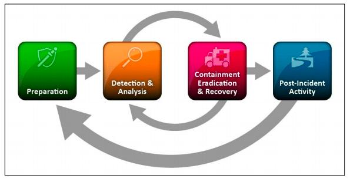
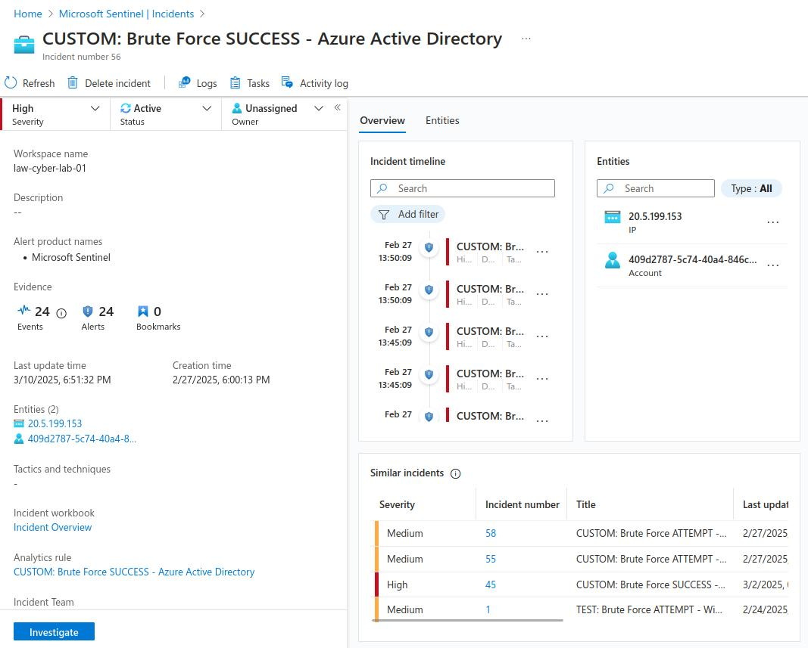
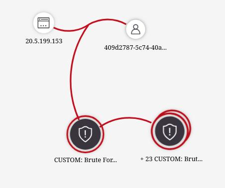

Work the incidents being generated within Azure Sentinel, in accordance with the NIST 800-61 Incident Management Lifecycle. Make use of the provided Pl



### Step 1: Preparation
- (We initiated this already by ingesting all of the logs into Log Analytics Workspace and Sentinel and configuring alert rules)
### Step 2: Detection & Analysis (You may have different alerts/incidents)
1. Set Severity, Status, Owner
2. View Full Details (New Experience)
3. Observe the Activity Log (for history of incident)
4. Observe Entities and Incident Timelines (are they doing anything else?)
5. “Investigate” the incident and continue trying to determine the scope
6. Inspect the entities and see if there are any related events
7. Determine legitimacy of the incident (True Positive, False Positive, etc.)
8. If True Positive, continue, if False positive, close it out

**Personal Incident Notes**  
Incident number 56  
Brute Force SUCCESS - Azure Active Directory  
Affected system: Azure Active Directory    
- Incident was created on 02/27/25, 06:00 PM from IP 20.5.199.153 (Sydney, Australia) on account dummy_attacker
- 14 attempts were made before a successful login
- Attacker has successfully brute forced on Windows, Azure Active Directory, and MS SQL Servers

```
//Useful KQLs
// Failed AAD logon
SigninLogs
| where Status.failureReason == "Invalid username or password or Invalid on-premise username or password."
| where TimeGenerated > ago(30d)
| project TimeGenerated, Status = Status.failureReason, UserPrincipalName, UserId, UserDisplayName, AppDisplayName, AttackerIP = IPAddress, IPAddressFromResourceProvider, City = LocationDetails.city, State = LocationDetails.state, Country = LocationDetails.country, Latitude = LocationDetails.geoCoordinates.latitude, Longitude = LocationDetails.geoCoordinates.longitude

// Successful AAD logon
SigninLogs
| where Status.errorCode == 0 
| where TimeGenerated > ago(30d)
| project TimeGenerated, Status = Status.errorCode, UserPrincipalName, UserId, UserDisplayName, AppDisplayName, AttackerIP = IPAddress, IPAddressFromResourceProvider, City = LocationDetails.city, State = LocationDetails.state, Country = LocationDetails.country, Latitude = LocationDetails.geoCoordinates.latitude, Longitude = LocationDetails.geoCoordinates.longitude
```




### Step 3: Containment, Eradication, and Recovery
Use the [Incident Response Playbook](3.11.1%20Incident%20Response%20Playbook.md).  

**Initial Response Actions**
- Verify the authenticity of the alert or report.
- Immediately identify and Revoke Sessions/Access for affected user
- Identify the origin of the attacker and determine if they are attacking or involved with anything else
- Assess the potential impact of the incident.
- What type of account was it?
- What Roles did it have?
- How long has it been since the breach went unattended?

**Containment and Recovery**
- Reset the affected user’s password and Roles if applicable
- Enable MFA
- Consider preventing any logins from outside the US with [Conditional Access](https://portal.azure.com/#view/Microsoft_AAD_ConditionalAccess/ConditionalAccessBlade/~/Policies)
- Document Findings and Close out Incident
### Step 4: Create Detailed Report and Close out the Incident in Sentinel
# **Cybersecurity Incident Report**
**Incident Number:** 56  
**Status:** True Positive  
**Date & Time of Incident:** 02/27/25, 06:00 PM  
**Reported By:** John Doe  
**Affected System(s):**
- **Azure Active Directory (AAD)**
## **1. Incident Summary**
At **02/27/25, 06:00 PM**, a successful **brute-force attack** was detected on **Azure Active Directory (AAD)**. The attacker, originating from **IP 20.5.199.153 (Sydney, Australia)**, gained unauthorized access using repeated login attempts through the **Login Portal** using account **dummy_attacker**. The attack was confirmed through log analysis and correlation of multiple failed and subsequent successful logins.

## **2. Indicators of Compromise (IoCs)**
- **Source IP Address:** `20.5.199.153` (Geolocated to Sydney, Australia)
- **Time of First Failed Login Attempt:** 2/18/2025, 11:55 AM
- **Total Failed Logins:** `19`
- **Time of First Successful Login:** 02/27/25, 06:00 PM
- **Targeted Username(s):** `dummy_attacker`
- **Authentication Method:** Portal Login
- **SigninLogs:**
    - **Failed password for dummy_attacker from 20.5.199.153** (Failed Logon Attempts)
    - **Status 0 for dummy_attacker from 20.5.199.153** (Successful Logon)
## **3. Impact Assessment**
- Unauthorized access granted to the Azure Active Directory
- Possible exfiltration of sensitive data (pending further investigation)
- Potential installation of malicious tools for persistence
- Increased risk of lateral movement across the network
## **4. Mitigation & Remediation**
**Immediate Actions Taken:**
- **User Account Disabled:** `Dummy_Attacker` account disabled
- **Password Reset:** Enforced password reset for affected accounts
- **Session Terminated:** All active sessions from `20.5.199.153` forcibly logged out
- **Enable Conditional Access:** Prevent users from outside of US from accessing Azure Active Directory (AAD)
- **Enable Multi-Factor Authorization:** Enforced MFA for affected accounts

**Ongoing Investigation:**
- Reviewing logs for suspicious activity post-compromise
- Scanning for malware or unauthorized changes
- Analyzing network traffic logs for data exfiltration attempts
## **5. Recommendations & Preventive Measures**
- Enforce **account lockout policy** after `5` failed attempts
- Enable **Multi-Factor Authentication (MFA)** for all accounts
## **6. Conclusion**
The attack resulted in a successful login but was **detected and mitigated before further damage could occur**. Additional investigation is ongoing to determine the extent of compromise and ensure no persistent threats remain.