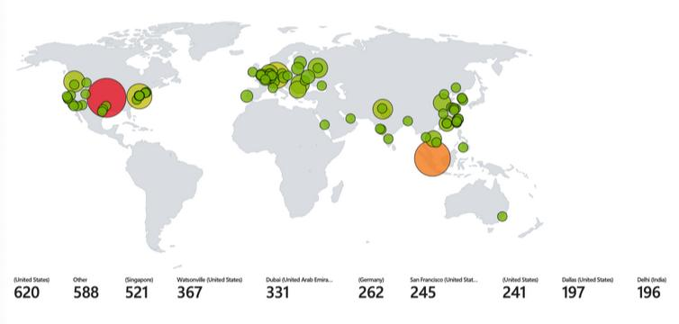

**Do you need your VMs to be on for this lab?**  
YES (windows-vm, linux-vm)  

We are going to create 4 different workbooks in Sentinel that show different types of malicious traffic from around the world, targeting our resources.  

——————————————————————————————————————

Ref: [JSON Files](https://github.com/joshmadakor1/Cyber-Course-V2/tree/main/Sentinel-Maps(JSON)) - Remember, Sentinel uses our Log Analytics Workspace where we ingested the logs

### Configure Microsoft Sentinel Workbook to Ingest Logs
**Microsoft Sentinel > LAW-Cyber-Lab-01 > Threat management > Workbooks > Add Workbook**  
*Note: You can remove the premade workbook by click on **Edit > 3 dots > Remove***  

**Add > Add query > Advanced Editor > Paste the below .json texts in the text field > Done editing > Done editing > Save**
- Keep title as the .json without file extension type
- Resource Group: **RG-Cyber-Lab**
- Location: **(US) East US 2**
- Save As

Within Azure Microsoft Sentinel, do the same for all of the following:
- Use **[windows-rdp-auth-fail.json](images/windows-rdp-auth-fail.json)** to create the “Windows RDP/SMB Authentication Failures” map
- Use **[linux-ssh-auth-fail.json](images/linux-ssh-auth-fail.json)** to create the “Linux SSH Authentication Failures” map
- Use **[mssql-auth-fail.json](images/mssql-auth-fail.json)** to create the “MS SQL Server Authentication Failures” map
- Use **[nsg-malicious-allowed-in.json](images/nsg-malicious-allowed-in.json)** to create the “NSG Allowed Malicious Inbound Flows” map

Observe any pre-existing malicious attack traffic on these maps from the Internet
Ensure an appropriate time-frame is being selected (30 days)
——————————————————————————————————————

If it’s been 24 hours since you created the resources being tracked on this map and you don’t see traffic to them, make sure of the following:
- First, generate traffic on your own to see if any logs show up
- Ensure both VMs are on
- Ensure Microsoft Defender for Cloud and the Data Collection Rules are configured correct to collect logs from the VMs (from section: Logging and Monitoring: Enable MDC and Configure Log Collection for Virtual Machines)
- Ensure Logging is correctly configured for MS SQL Server (from section: Azure Intro: Creating our Subscription and First Resources)
- If NSG FLow Logs are empty, ensure they are configured correctly (from section: Logging and Monitoring: Enable MDC and Configure Log Collection for Virtual Machines)
- Alternatively, you can skip ahead to the “Azure Sentinel: Attack Traffic Generation” section to generate some traffic, but we need to make sure logging is configured correctly and showing up before that will work.

We’re going to continue to work with logs from the VMs, so it may be a good idea to leave your VM’s on (unless you’re going to go to bed or something and want to maximize your savings)