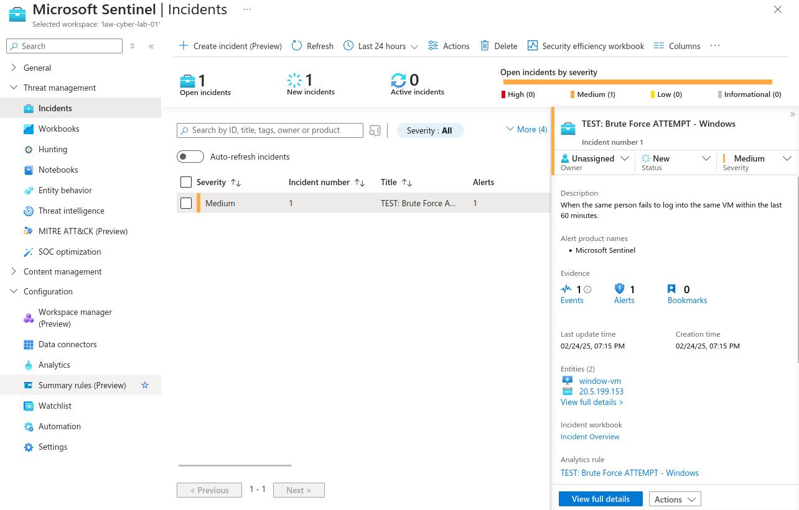

**Do you need your VMs to be on for this lab?**  
YES (windows-vm)  

### Creating an Analytics Rule
 **Microsoft Sentinel > LAW-Cyber-Lab-01 > Configuration > Analytics > Create > Scheduled query rule**
- **General**
	- Name: **TEST: Brute Force ATTEMPT - Windows**
	- Description: **When the same person fails to log into the same VM within the last 60 minutes.**
	- Next
- **Set rule logic**
	- Rule query:
```
SecurityEvent  
 | where EventID == 4625  
 | where TimeGenerated > ago(60m)  
 | summarize FailureCount = count() by AttackerIP = IpAddress, EventID, Activity, DestinationHostName = Computer  
 | where FailureCount >= 10
```
- 	
	- Entity mapping > Add new entity
		- **IP, Address, AttackerIP**
	- Entity mapping > Add new entity
		- **Host, HostName, DestinationHostName**
	- Run query every: **5 Minutes**
	- Next
- **Incident settings**
	- Incident settings: **Enabled**
	- Alert grouping: **Enabled**
- Save

### Generating Failed Logins
- Attempt to RDP login to window-vm and fail 10+ times
- Observe generated incident
	- **Microsoft Sentinel >  LAW-Cyber-Lab-01 > Threat management > Incidents**  
	  *Note: This may take about 5 minutes to appear since we set the query to run every 5 minutes*
	- Click on and observe the incident  
	 
	- Click on **Actions > Investigate** to see a visual map
- Delete the Rule when finished

We’re going to continue to work with logs from the VMs, so it may be a good idea to leave your VM’s on (unless you’re going to go to bed or something and want to maximize your savings)