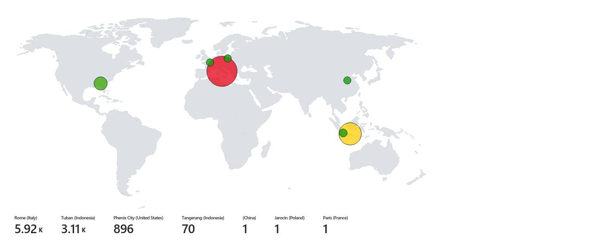
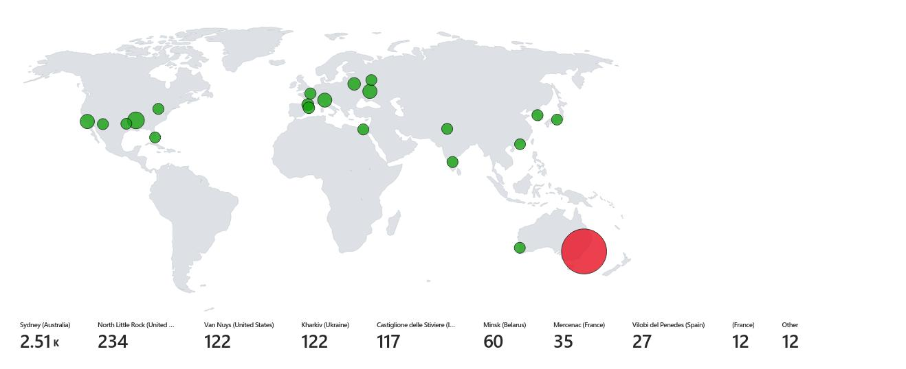
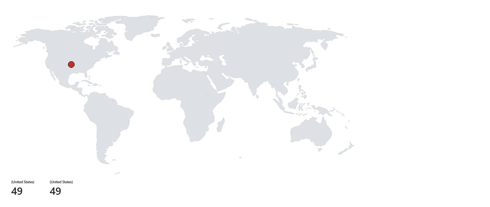
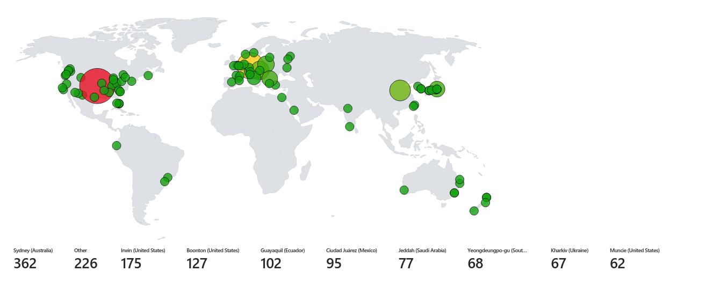

Spreadsheet: [SOC Lab 1 - BEFORE AND AFTER Spreadsheet](images/SOC%20Lab%201%20-%20BEFORE%20AND%20AFTER.xlsx)
## Documenting Logs from Insecure Environment
After letting our window-vm and linux-vm run insecure for 24 hours, log KQL queries into the spreadsheet.
### KQL Queries
```
//Security Events (Windows VMs)
SecurityEvent
| where TimeGenerated >= ago(24h)
| count
```

```
//Syslog (Linux VMs)
Syslog
| where TimeGenerated >= ago(24h)
| count
```

```
//SecurityAlert (Microsoft Defender for Cloud)
SecurityAlert
| where DisplayName !startswith "CUSTOM" and DisplayName !startswith "TEST"
| where TimeGenerated >= ago(24h)
| count
```

```
//Security Incident (Sentinel Incidents)
SecurityIncident
| where TimeGenerated >= ago(24h)
| count
```

```
//NSG Inbound Malicious Flows Allowed
AzureNetworkAnalytics_CL 
| where FlowType_s == "MaliciousFlow" and AllowedInFlows_d > 0
| where TimeGenerated >= ago(24h)
| count
```

### Screenshot Microsoft Sentinel Workbooks (Be sure to set time range for 24 hours)
**Microsoft Sentinel > LAW-Cyber-Lab-01 > Threat management > Workbooks > View saved workbook > Edit > Edit**
- **windows-rdp-auth-fail**
- **linux-ssh-auth-fail**
- **mssql-auth-fail**
- **nsg-malicious-allowed-in**
### windows-rdp-auth-fail (24 hour, Before hardening)

-

### linux-ssh-auth-fail (24 hour, Before hardening)

-

###  mssql-auth-fail (24 hour, Before hardening)

-

### nsg-malicious-allowed-in (24 hour, Before hardening)
