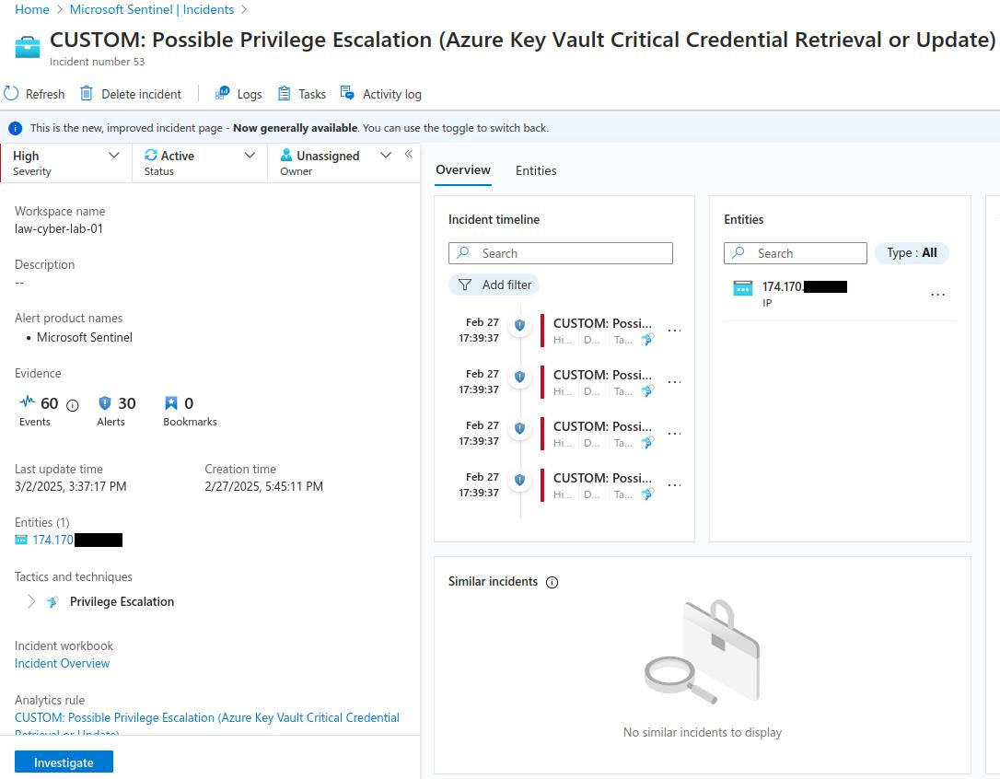
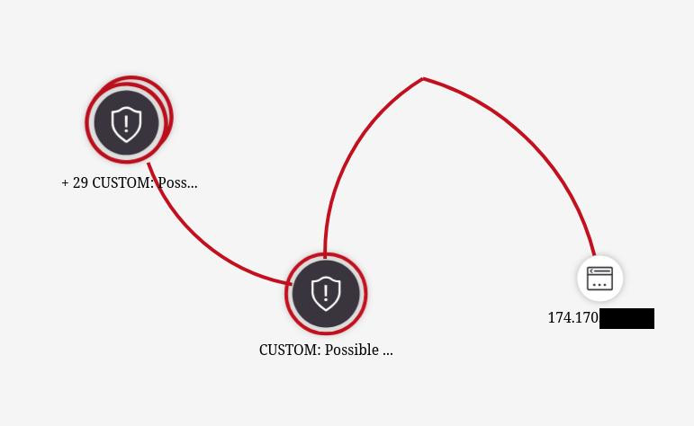

Work the incidents being generated within Azure Sentinel, in accordance with the NIST 800-61 Incident Management Lifecycle. Make use of the provided Pl

## Step 1: Preparation
- (We initiated this already by ingesting all of the logs into Log Analytics Workspace and Sentinel and configuring alert rules)
### Step 2: Detection & Analysis (You may have different alerts/incidents)
1. Set Severity, Status, Owner
2. View Full Details (New Experience)
3. Observe the Activity Log (for history of incident)
4. Observe Entities and Incident Timelines (are they doing anything else?)
5. “Investigate” the incident and continue trying to determine the scope
6. Inspect the entities and see if there are any related events
7. Determine legitimacy of the incident (True Positive, False Positive, etc.)
8. If True Positive, continue, if False positive, close it out

**Personal Incident Notes**  
Incident number 53  
Possible Privilege Escalation (Azure Key Vault Critical Credential Retrieval or Update)  
Affected system: Azure Key Vault Secret
- Incident was created on 2/27/2025, 5:45:11 PM from IP 174.170.xxx.xxx
- This incident involves the unexpected reading of a critical secret from the organization's Key Vault.

### Step 3: Containment, Eradication, and Recovery
Use the [Incident Response Playbook](3.11.1%20Incident%20Response%20Playbook.md).

**Initial Response Actions**
- Verify the authenticity of the alert or report.
- Identify the secret that was read and the user or application that read it.
- Determine how and when the secret was read.
- Assess the potential impact of the incident.

**Containment and Recovery**
- Revoke access to the secret from the affected user or application immediately if unintended, otherwise skip to the documentation phase.
- Check for any other unauthorized access to the secret and revoke it if necessary.
- Monitor the affected systems for any suspicious activity related to the incident.
- Identify the root cause of the incident and take corrective actions to prevent similar incidents from occurring in the future.
- Change the secret if it was compromised.
### Step 4: Create Detailed Report and Close out the Incident in Sentinel
# **Cybersecurity Incident Report**
**Incident Number:** 53  
**Status:** False Positive  
**Date & Time of Incident:** 2/27/2025, 5:45:11 PM  
**Reported By:** John Doe  
**Affected System(s):**
- **Azure Key Vault Secret**
## **1. Incident Summary**
At **2/27/2025, 5:45:11 PM**, a **Possible Azure Privilege Escalation** was detected from **IP 174.170.xxx.xxx**. The user viewed critical credentials many times. The user has was confirmed that they were just doing their normal duties, confirmed this with their manager.
## **2. Indicators of Compromise (IoCs)**
- N/a
## **3. Impact Assessment**
- N/a
## **4. Mitigation & Remediation**
**Immediate Actions Taken:**
- Verify the authenticity of the alert or report.
- Contacted user and manager for confirmation of use and duties.
## **5. Recommendations & Preventive Measures**
- N/a
## **6. Conclusion**
User was doing normal duties within scope and was confirmed by manager.