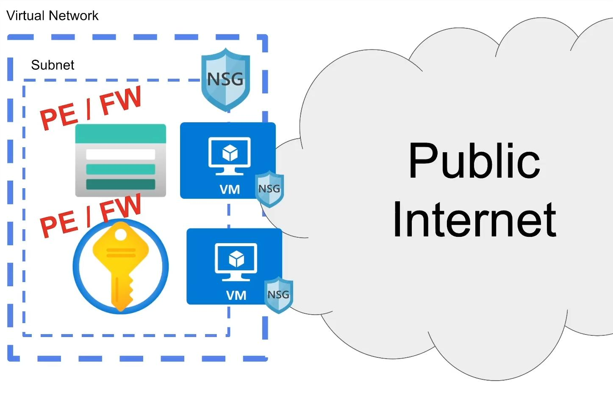
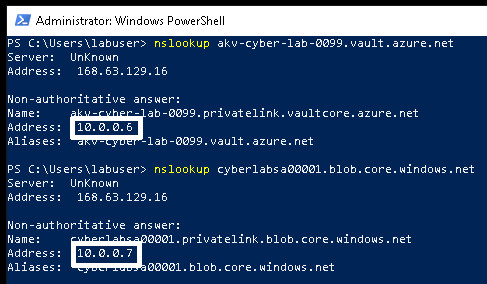

**Do you need your VMs to be on for this lab?**  
YES (windows-vm)  

## NIST 800-53 Rev. 5 Remediation
These were the remediations to SC-7 that were done in this lab to be compliant to NIST 800-53 R5. The remediation steps can be found when observing the non-compliant issues.

- **Configure Azure Private Link and Firewall for your Azure Key Vault instance**
	- Ensure you use the same region and VNet the rest of your VMs are in
- **Configure Azure Private Link and Firewall for your Azure Storage Account instance**
	- **Storage sccounts > cyerlabsa00001 > Setting + networking > Networking**
		- **Firewalls and virtual networks**
			- Disable Public Access (you can only access from within your VMs now.)
			- This is done on the network tab as well as the Settings -> configuration “Allow Blob public access → Disabled” as well
		- **Private endpoint connections**
			- Create Private endpoint connection
				- Fill in basic information and check that subscription and resource groups are correct and click **Next** on all except,
					- **Resources**
						- Target sub-resource: **blob**
			- **Review + create**

### Observe Network Watcher Topology for the region and resource group all of your stuff is in
**Network Watcher > Monitor > Topology**
*You may need to click on the Blue + to see the topology*

### Observe the Key Vault and Storage Account Private Endpoints are there  
Key Vault 

Login to “windows-vm” and check the IP addresses of your Key Vault and Storage Account instances with PowerShell.  
- *Note: If you can't log in to your **windows-vm**, check to see if you IP address has changed. If it has, you will have to update the Inbound Rule with the new IP **windows-vm > Settings > Networking > Inbound port rules***  

They should be private addresses, indicating the resources have been probably integrated into private VNet:  

**If you see a public IP address, either it’s not done propagating yet, or it’s not configured correctly**  
Possible causes for this are your resources and VM are actually in different Virtual Networks, or something is just not setup right. The good news is, you don’t need to fix this for the rest of the lab, we are just trying to lock down the environment. However, if you want to fix it, you can try deleting the Private Endpoints/config and trying again  

### Creating and Attaching a Network Security Group to the Subnet
**Network security group > Create**
- Subscription: **Azure subscription 1**
	- Resource Group: RG-Cyber-Lab
- Name: **nsg-subnet**
- Region: **East US 2**
- **Review + create**
**Virtual Networks > Lab-VNet > Settings > Subnets > default**
- Edit subnet
	-  Security
		- Network security group: **nsg-subnet**
- **Save**

**Let window-vm and linux-vm run for 24 hours.**
- 24 hours later, we are going to capture our statistics for the locked down environment for our portfolio!

