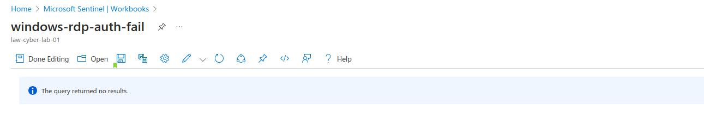
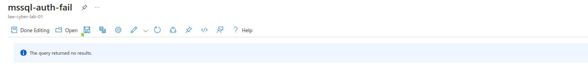

# Building a SOC + Honeynet in Azure (Live Traffic) 

## 🛡️ Introduction 🛡️
In this project, I constructed a mini honeynet in Azure, integrating log sources from various resources into a Log Analytics workspace. This data was utilized by Microsoft Sentinel to build attack maps, trigger alerts, and create incidents. I measured security metrics in the initial, unsecured environment for 24 hours, then applied security controls to harden the environment, followed by another 24-hour measurement period. The results of these metrics, which are detailed below, demonstrate the impact of the applied security controls:

**The metrics we will show are:**
- SecurityEvent (Windows Event Logs)
- Syslog (Linux Event Logs)
- SecurityAlert (Log Analytics Alerts Triggered)
- SecurityIncident (Incidents created by Sentinel)
- AzureNetworkAnalytics_CL (Malicious Flows allowed into our honeynet)

## Architecture Before Hardening / Security Controls

## Architecture After Hardening / Security Controls

**The architecture of the mini honeynet in Azure consists of the following components:**
- Virtual Network (VNet)
- Network Security Group (NSG)
- Virtual Machines (2 windows, 1 linux)
- Log Analytics Workspace
- Azure Key Vault
- Azure Storage Account
- Microsoft Sentinel

**Technologies, Azure Components, and Regulations Employed**
- Azure Virtual Network (VNet)
- Azure Network Security Groups (NSG)
- Virtual Machines (2 Windows VMs, 1 Linux VM)
- Log Analytics Workspace with Kusto Query Language (KQL) Queries
- Azure Key Vault for Secure Secrets Management
- Azure Storage Account for Data Storage
- Microsoft Sentinel for Security Information and Event Management (SIEM)
- Microsoft Defender for Cloud to Protect Cloud Resources
- Windows Remote Desktop for Remote Access
- Command Line Interface (CLI) for System Management
- PowerShell for Automation and Configuration Management
- [NIST SP 800-53 Revision 5](https://csrc.nist.gov/publications/detail/sp/800-53/rev-5/final) for Security Controls
- [NIST SP 800-61 Revision 2](https://www.nist.gov/privacy-framework/nist-sp-800-61) for Incident Handling Guidance

For the "BEFORE" metrics, all resources were initially deployed with direct exposure to the internet. The Virtual Machines had both their Network Security Groups and built-in firewalls configured with unrestricted access, and all other resources were deployed with public endpoints visible to the internet, rendering private endpoints unnecessary.

In contrast, for the "AFTER" metrics, significant security enhancements were implemented. Network Security Groups were fortified by restricting ALL traffic except for access from designated admin workstations. Additionally, all other resources were shielded by their built-in firewalls and reinforced with the implementation of Private Endpoints.

## Azure Sentinel Before Hardening / Security Controls

## Attack Maps Before Hardening / Security Controls

### windows-rdp-auth-fail (24 hour, Before hardening)

### linux-ssh-auth-fail (24 hour, Before hardening)

###  mssql-auth-fail (24 hour, Before hardening)

### nsg-malicious-allowed-in (24 hour, Before hardening)

## Metrics Before Hardening / Security Controls
The following table displays the metrics we measured in the insecure environment for 24 hours:
**Start Time February 23, 2025, 12:00:00 AM**
**Stop Time February 24, 2025, 12:00:00 AM**

| Metric                   | Count
| ------------------------ | -----
| SecurityEvent            | 13163
| Syslog                   | 9448
| SecurityAlert            | 1
| SecurityIncident         | 668
| AzureNetworkAnalytics_CL | 6699
## MS Sentinel After Hardening / Security Controls
Microsoft Sentinel is important for monitoring and securing cloud environments. It provides tools to detect and respond to security threats across the organization. By collecting and analyzing data, it helps identify potential issues and offers solutions to improve security. This tool helps protect sensitive information and ensures that the organization stays secure and compliant with industry standards.

## NIST 800-53 Cybersecurity Framework 

The NIST 800-53 framework is important for keeping organizations' information systems secure. It offers a set of guidelines to protect against various threats, helping organizations safeguard sensitive data and comply with regulations. By following these guidelines, organizations can identify and reduce risks, making their digital operations more secure and reliable.

## MS Defender for Cloud After NIST SP 800 53 R5 Regulatory Compliance Application

Microsoft Defender for Cloud is essential for keeping cloud environments secure. It helps manage security across different cloud services and protects against threats. By regularly checking the security of resources, it provides easy-to-follow recommendations and automates security practices. This tool ensures that sensitive data is protected and that the organization meets industry security standards, making cloud operations more reliable and secure.

## Attack Maps After Hardening / Security Controls
**Start Time March 17, 2025, 12:00:00 AM**
**Stop Time March 18, 2025, 12:00:00 AM**
### windows-rdp-auth-fail (24 hour, After hardening)

### linux-ssh-auth-fail (24 hour, After hardening)

###  mssql-auth-fail (24 hour, After hardening)

### nsg-malicious-allowed-in (24 hour, After hardening)

## Metrics After Hardening / Security Controls
The following table displays the metrics measured in the secure environment for another 24 hours. This is after the application of security controls:
**Start Time March 17, 2025, 12:00:00 AM**
**Stop Time March 18, 2025, 12:00:00 AM**

| Metric                   | Count
| ------------------------ | -----
| SecurityEvent            | 1792
| Syslog                   | 6
| SecurityAlert            | 0
| SecurityIncident         | 0
| AzureNetworkAnalytics_CL | 0

| Metric                   | % After Hardening Environment
| ------------------------ | -----
| SecurityEvent            | -86.39%
| Syslog                   | -99.94%
| SecurityAlert            | -100%
| SecurityIncident         | -100%
| AzureNetworkAnalytics_CL | -100%    

## Incident Response
**Detection & Analysis**
- Malware has been detected on a workstation with the potential to compromise the confidentiality, integrity, or availability of the system and data.
- Assigned alert to an owner, set the severity to "High", and the status to "Active"
- Identified the primary user account of the system and all systems affected.
- A full scan of the system was conducted using up-to-date antivirus software to identify the malware.
- Verified the authenticity of the alert as a "True Positive".
- Sent notifications to appropriate personnel as required by the organization's communication policies.

**Containment, Eradication & Recovery**
- The infected system and any additional systems infected by the malware were quarantined.
- If the malware was unable to be removed or the system sustained damage, the system would have been shut down and disconnected from the network.
- Depending on organizational policies the affected systems could be restored known clean state, such as a system image or a clean installation of the operating system and applications. Or an up-to-date anti-virus solution could be used to clean the systems.

**Post-Incident Activity**
- In this simulated case, an employee had downloaded a game that contained malware.
- All information was gathered and analyzed to determine the root cause, extent of damage, and effectiveness of the response.
- Report disseminated to all stakeholders.
- Corrective actions are implemented to remediate the root cause.
- And a lessons-learned review of the incident was conducted.
## Conclusion
In this project, I constructed a mini honeynet in Microsoft Azure and integrated log sources into a Log Analytics workspace. Utilizing Microsoft Sentinel, I triggered alerts and created incidents based on the ingested logs. Metrics were measured in the insecure environment before applying security controls and then again after implementing these measures. The results showed a significant reduction in security events and incidents post-implementation, demonstrating the effectiveness of the security controls.

It is important to note that if the network resources had been heavily utilized by regular users, more security events and alerts might have been generated within the 24-hour period following the implementation of the security controls.
